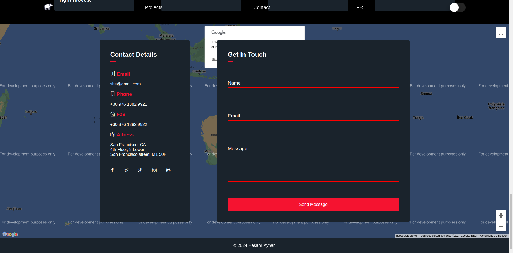

# Portfolio Website

This repository hosts the code for a dynamic portfolio website, designed to showcase projects, achievements, and professional information. The site is built with PHP, featuring a multi-language support system and dynamic content management via a MySQL database.

## Project Structure

- `index.php`: The main entry point of the website, displaying the homepage and various sections like projects, resume, and contact information.
- `loading.php`: A transitional loading page that is displayed when navigating to detailed project views.
- `project.php`: Displays detailed information about a specific project selected by the user.
- `config.php`: Configuration file that sets up database connection and language settings.
- `main.js`: Contains JavaScript for interactive elements such as form validation and dynamic content filtering.
- `process_contact.php`: Handles the AJAX form submission for the contact form.

### Directories

- `/css`: Contains all the CSS files for styling the website.
- `/img`: Hosts image resources used across the site.
- `/lang`: Includes PHP files for multi-language support (`en.php` for English, `fr.php` for French).

## Setup

### Prerequisites

- PHP server environment (e.g., XAMPP, WAMP, MAMP, or a LAMP stack on Linux)
- MySQL database server
- Composer (optional, for managing PHP dependencies if any)

### Installation

1. Clone the repository to your local machine or server document root.
2. Import the MySQL database schema located in `schema.sql` (not provided in your files but assumed to be part of the setup).
3. Configure your database connection settings in `config.php` by updating the `$host`, `$db`, `$user`, and `$password` variables.
4. Ensure the PHP server is running and visit the site in your browser.

## Features

- **Multi-Language Support**: Toggle between English and French languages for a broad audience.
- **Dynamic Content**: Projects and resume details are fetched from the database, making it easy to update and maintain.
- **Responsive Design**: The site is fully responsive and adapts to various screen sizes and devices.
- **Interactive Elements**: Utilizes JavaScript for form validation and interactive UI components.

## Contributing

Contributions are welcome! Feel free to fork the repository, make your changes, and submit a pull request. Whether it's a bug fix, feature addition, or documentation improvement, all contributions are appreciated.